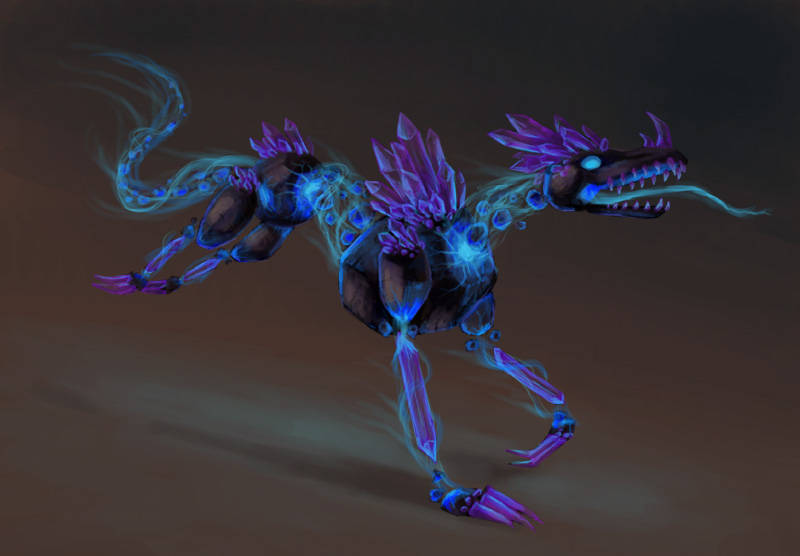
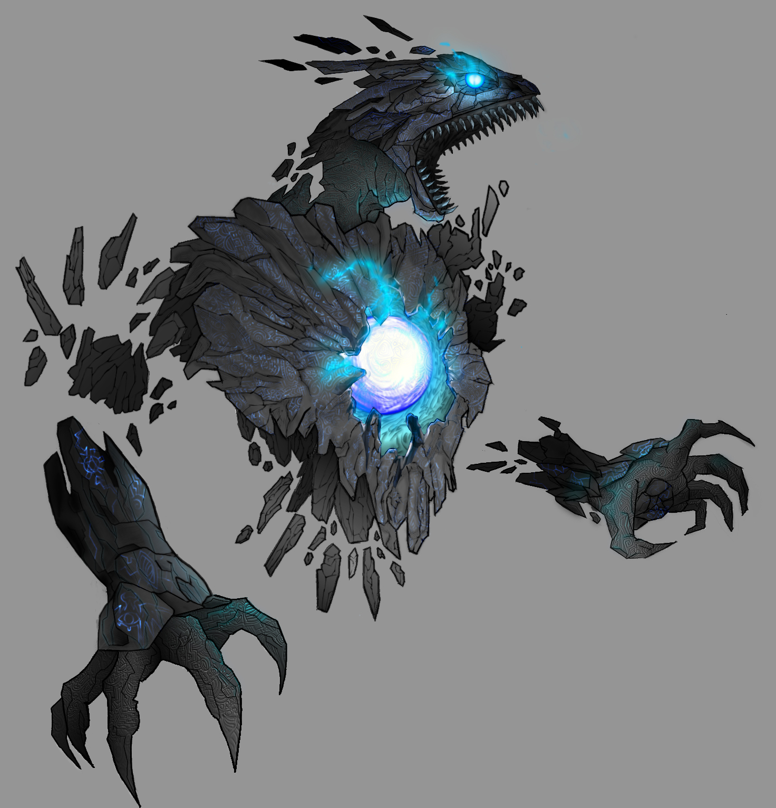

## Function
Telekinesis, for example like those obsidian lions? those fuckers, something like that that accelerates a flechette of rock at long-arm velocity.
## Lore

An abiogenetic siliceous creature, the shardmane is an extraterrestrial quadruped with the rough shape of a disembodied, partially skeletonized lion.

Its most distinctive feature is a layer of sharp projections that float around the front quadrant of the creature, particularly around its neck and face, which appear like razor sharp shreds of red obsidian. These shards act like spaced armor, stopping bites and deflecting projectiles.

Upon observation, the otherwise disconnected shards appear to flex in sync with the rest of the body. It is hypothesized that these shards are a defense mechanism that are anchored to the creature on another geometric plane.
### Design Log

 * Design level: Unfinished concept

 * the unusual features are primarily narrative. Are there any special abilities we could give them to make them more than just distinctive visually/stylistic?

#### Original Inspiration

<a href="https://cdn.vox-cdn.com/thumbor/Yiy6pK8QvKLBtJvNDo6kUJ0dMhI=/0x0:1000x667/1200x800/filters:focal(0x0:1000x667)/cdn.vox-cdn.com/uploads/chorus_image/image/35889652/lionfish-noaa-gov.0.jpg">Lionfish</a>

 <a href="https://live.staticflickr.com/6225/6333905242_2c74e94312_b.jpg">Hydralisk</a>
